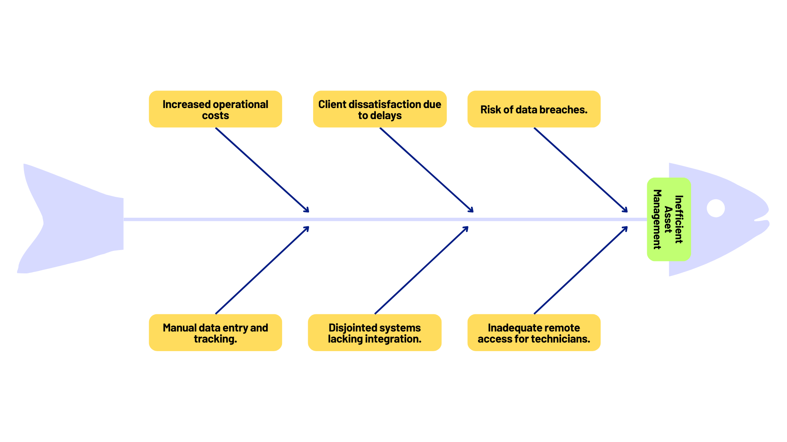
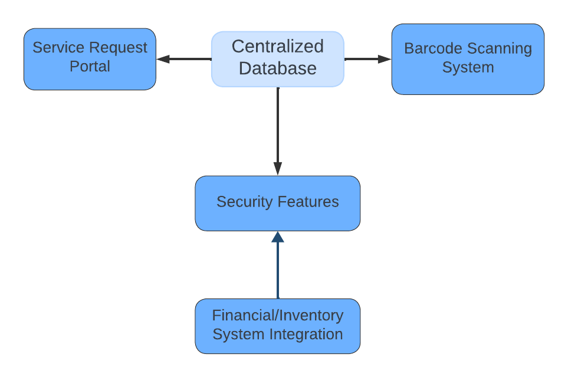
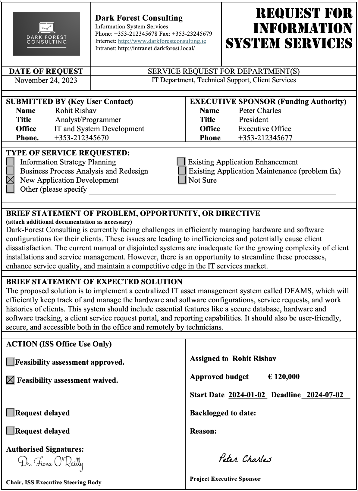
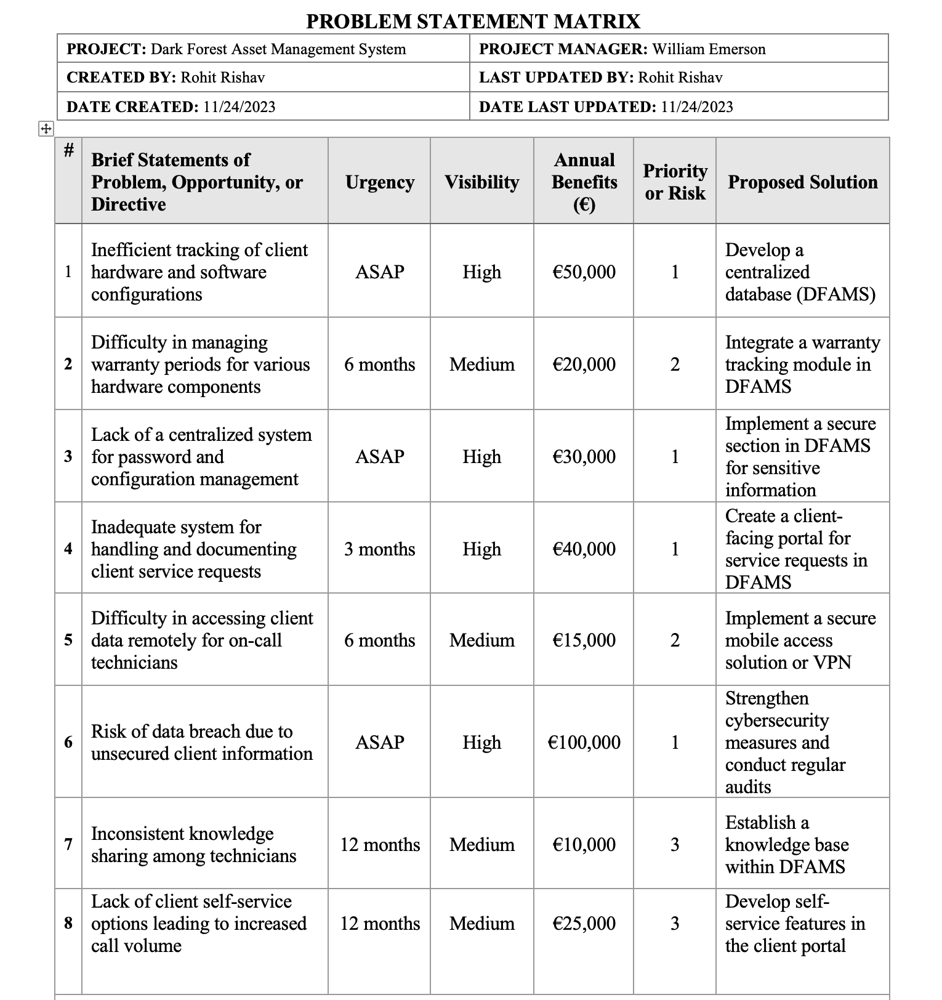
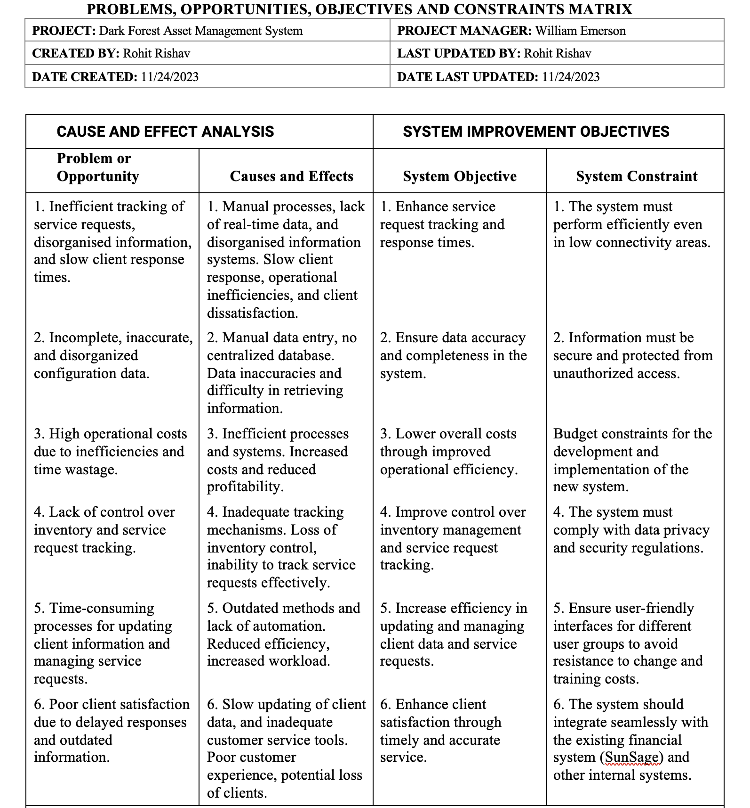

# Dark Forest Asset Management System (DFAMS)

## Project Overview

The **Dark Forest Asset Management System (DFAMS)** project was undertaken to address the growing challenges faced by Dark Forest Consulting, a provider of computer networks and web services in Cork, Ireland. Managing hardware and software configurations became increasingly difficult as the complexity of client installations and the number of clients grew. This led to inefficiencies, delayed responses, and potential client dissatisfaction. 

The DFAMS project aimed to streamline and centralize the management of client assets, service requests, and warranties, thereby improving operational efficiency, enhancing service quality, and ensuring client satisfaction.

## Background

Dark Forest Consulting operates in a dynamic environment where clients rely heavily on their IT infrastructure. The company's success depends on its ability to provide timely and accurate client support. However, the existing systems for tracking client hardware, software configurations, and service requests were manual, disjointed, and prone to errors. 

## Problem Statement: Inefficient Management of Client Assets

The following diagram illustrates the core issues faced by Dark Forest Consulting, including the causes and effects that contributed to the inefficiencies in managing client assets:

As shown in the diagram, the main problem was the inefficient management of client hardware and software configurations, leading to increased operational costs, client dissatisfaction, and risks of data breaches.

## Solution Overview

To address these challenges, the DFAMS project proposed a comprehensive solution comprising several key components:

## Solution Architecture

The DFAMS solution was designed with a centralized database at its core, integrating various systems and features to streamline processes and enhance service quality. The following diagram illustrates the high-level architecture of the solution:

This architecture shows how the centralized database interacts with the service request portal, barcode scanning system, security features, and existing financial and inventory systems, effectively addressing the issues identified in the problem statement.

## Deliverables

The DFAMS project was structured into several key deliverables, each addressing a specific aspect of the system analysis and design process. Below is an explanation of each deliverable and its significance:

### Part 1: Request for Information System Service & Problem Statement Matrix
- **Request for Information System Service**: A formal document initiating the project, outlining the key problems, opportunities, and directives. This document provided the foundation for the project's objectives and scope.

- **Problem Statement Matrix**: This matrix identified and prioritized the critical issues facing Dark Forest Consulting, including inefficient tracking, warranty management, and service request handling. It provided a structured approach to address these issues systematically.

### Part 2: Problems, Opportunities, Objectives, and Constraints Matrix & List of Requirements
- **POC Matrix**: This matrix mapped out the causes and effects of identified problems and aligned them with system improvement objectives. It helped ensure that the project’s solutions were directly addressing the most critical business needs.

- **List of Requirements**: Detailed the functional and non-functional requirements of the DFAMS, ensuring that all technical and user needs were captured. This list served as the blueprint for the system's design and development.

## Functional Requirements:

1. **Configuration and Component Tracking:**
   1.1. A searchable database for client configuration and component tracking.
   1.2. Barcode scanning functionality for inventory management and logging components at client sites.
   1.3. System to automatically record the type and details of components during inventory check-ins and installations.

2. **Service Request Management:**
   2.1. A portal for clients to submit service requests and report problems.
   2.2. Tracking the progress of each service request until it's resolved.
   2.3. Maintenance of a detailed history of services performed on each issue.
   2.4. Allowing technicians to view open service requests and select them for resolution.
   2.5. Automatic escalation feature for service requests that remain unresolved for a specific time, with the ability to override the default time.

3. **Warranty Tracking:**
   3.1. A feature for technicians to access warranty information for each piece of equipment while on-site.

4. **Configuration Information Management:**
   4.1. Tracking system for sensitive configuration data such as usernames, passwords, IP addresses, port numbers, and web addresses.
   4.2. A web-enabled database that allows real-time updates from the client's place of business.

5. **Client Interaction:**
   5.1. Functionality for clients to independently enter their service requests online.
   5.2. Capability for staff to enter service requests on behalf of clients when they call in.

6. **System Integration:**
   6.1. Integration with the existing financial system, SunSage, to access and consider clients' outstanding bills.

## Non-Functional Requirements:

1. **Security:**
   - Measures to secure the database against unauthorized access and protect it from hacking.
   - A system to prevent bogus service requests and ensure that only authorized personnel can enter work records and resolve service requests.

2. **Usability:**
   - A user-friendly interface designed for easy use by all staff members.
   - System accessibility from various devices, including mobile phones and tablet PCs, facilitates updates from anywhere.

3. **Reliability and Performance:**
   - Reliable operation in environments with limited or no internet connectivity.
   - Efficient data synchronization between field operatives' devices and the central office's master database.
   - Automatic marking of service requests as resolved if no further activity is reported from the client within a specified period.

### Part 3: Use-Case Model Glossary & Diagram
- **Use-Case Model Glossary**: Defined the key terms and interactions within the system, ensuring a common understanding among all stakeholders.
- **Use-Case Model Diagram**: Visually represented the interactions between users (clients, technicians, and administrators) and the system, helping to clarify the system's functionality and user interface.

### Part 4: Entity/Definition Matrix, Entity Relationship Diagram (ERD), Activity Diagram & UML Class Diagram
- **Entity/Definition Matrix**: Defined the data entities within the system, such as clients, service requests, and equipment, and described their attributes and relationships.
- **Entity Relationship Diagram (ERD)**: Illustrated the relationships between data entities, providing a blueprint for the database structure.
- **Activity Diagram**: Mapped out the workflow for service requests, ensuring efficient process management.
- **UML Class Diagram**: Modeled the system's object-oriented structure, defining the classes and their relationships.

### Part 5: User Persona, Scenario, and User Stories
- **User Persona**: Created detailed personas representing the system's end-users, such as technicians and clients, to ensure the system met their needs.
- **Scenario & User Stories**: Developed scenarios and user stories to guide the system's design from a user-centric perspective, ensuring a focus on usability and functionality.

## Business Objectives

The primary business objectives of the DFAMS project were:
1. **Enhance Operational Efficiency**: By centralizing and automating asset management processes, the project aimed to reduce the time and effort required to track and manage client configurations, service requests, and warranties.
2. **Improve Service Quality**: The system was designed to ensure timely and accurate responses to client issues, reducing downtime and improving client satisfaction.
3. **Ensure Data Security and Accessibility**: The DFAMS aimed to provide secure access to critical client data for on-call technicians, ensuring that they could provide support from any location without compromising security.
4. **Support Business Growth**: By improving the efficiency and quality of service delivery, the project aimed to support the company's growth by retaining existing clients and attracting new ones.

## Business Outcomes

The successful implementation of the DFAMS resulted in several positive business outcomes:
- **Increased Efficiency**: The centralized system significantly reduced the time spent on manual data entry and retrieval, allowing technicians to focus on solving client issues rather than administrative tasks.
- **Higher Client Satisfaction**: The improved tracking of service requests and configurations led to faster response times and fewer errors, which translated into higher client satisfaction and retention.
- **Enhanced Security**: The system's robust security features ensured that sensitive client data was protected, reducing the risk of data breaches and maintaining client trust.
- **Scalability for Future Growth**: The system was designed with scalability in mind, allowing Dark Forest Consulting to expand its operations without facing the same inefficiencies that previously hindered growth.

## How to Use this Repository

This repository contains all the deliverables related to the DFAMS project. Each folder corresponds to a specific part of the project and contains the relevant documentation and diagrams.

### Folder Structure
- **Part1_Request_Documents**: Contains the Request for Information System Service and Problem Statement Matrix.
- **Part2_Analysis_Matrices**: Contains the POC Matrix and List of Requirements.
- **Part3_Use_Cases**: Contains the Use-Case Model Glossary and Diagram.
- **Part4_Diagrams**: Contains the Entity/Definition Matrix, ERD, Activity Diagram, and UML Class Diagram.
- **Part5_User_Personas**: Contains the User Personas, Scenarios, and User Stories.

### Viewing the Documents
Each document is stored in its respective folder and can be viewed directly on GitHub or downloaded for offline use. Diagrams are provided in both image formats and as part of the documentation files.

---

This repository serves as a comprehensive resource for understanding the DFAMS project and its deliverables. It showcases the systematic approach taken to analyze, design, and implement a solution that addresses the complex needs of Dark Forest Consulting.
